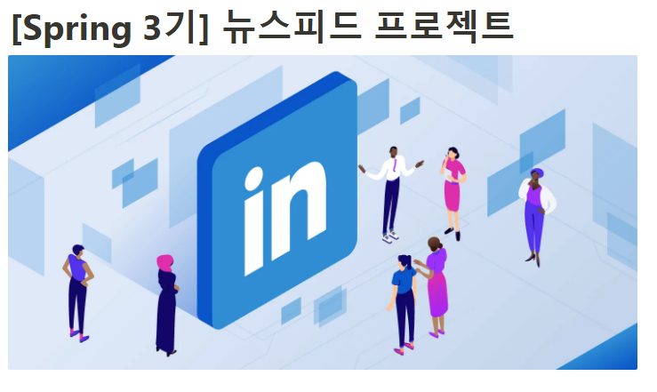
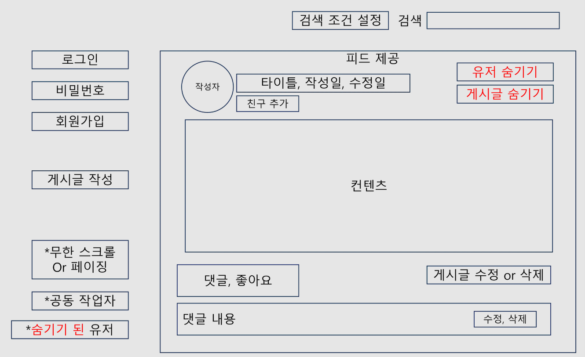
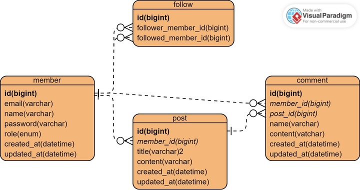
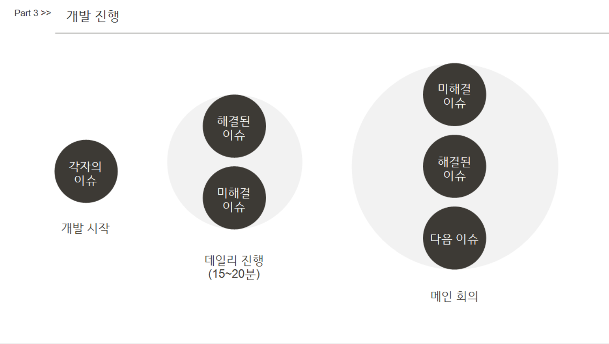
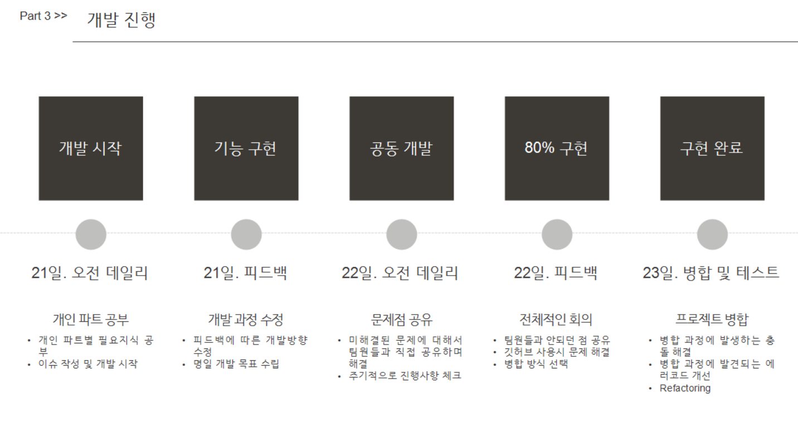

# news-feed-backend
## 🖥️프로젝트 소개

---
### 프로젝트 명 : 뉴스피드 프로젝트

* SNS 같은 프로그램 만들기입니다.

---
## 📆 개발 기간
* 24.10.17 ~ 24.10.24

---

## 🛠️ 백엔드 사용 기술


---
### 👨‍💻 팀원 소개
|          장민우           |          권익현           |           이한식           |          윤영한        |
|:----------------------:|:----------------------:|:-----------------------:|:-------------------:|
|           조장           |           팀원           |           팀원            |           팀원        |
| | |  |  |


<br>


## 📁 프로젝트 설계

---

### 📝 와이어 프레임



### 📋API 명세서- 일정 관리 시스템
| API 명칭           | 메서드  | 요청 URL                                      | 요청 헤더                            | 요청 본문                                                                                     | 응답 코드 | 설명               | 응답 본문                                                                                                                    |
|------------------|-------|-------------------------------------------|--------------------------------|-------------------------------------------------------------------------------------------|-------|------------------|--------------------------------------------------------------------------------------------------------------------------|
| 회원가입            | POST  | /api/members/signup                      | Content-Type: application/json | ```json { "name": "test", "password": "1234", "email": "test@example.com", "admin": false } ``` | 201   | 회원 가입 성공        | N/A                                                                                                                      |
| 로그인             | POST  | /api/members/login                       | Content-Type: application/json | ```json { "email": "test@example.com", "password": "1234" } ```                             | 200   | 로그인 성공           | N/A                                                                                                                      |
| 게시물 작성          | POST  | /api/posts                               | Authorization: Bearer Token     | ```json { "title": "새로운 게시물 제목3", "content": "이것은 게시물의 내용입니다.3" } ```          | 201   | 게시물 작성 성공       | ```json { "id": 1, "title": "새로운 게시물 제목3", "content": "이것은 게시물의 내용입니다.3", "createdAt": "2024-10-23" } ``` |
| 게시물 수정          | PUT   | /api/posts/{postId}                      | Authorization: Bearer Token     | ```json { "title": "수정된 게시물 제목", "content": "수정된 게시물의 내용입니다." } ```          | 200   | 게시물 수정 성공       | N/A                                                                                                                      |
| 게시물 삭제          | DELETE| /api/posts/{postId}                      | Authorization: Bearer Token     | N/A                                                                                       | 204   | 게시물 삭제 성공       | N/A                                                                                                                      |
| 게시물 조회          | GET   | /api/posts?page=1&size=10               | Authorization: Bearer Token     | N/A                                                                                       | 200   | 게시물 목록 조회 성공    | ```json [ { "id": 1, "title": "게시물 제목", "content": "내용", "createdAt": "2024-10-23" } ] ```                         |
| 기간별 게시물 조회      | GET   | /api/posts/date-range                   | N/A                              | N/A                                                                                       | 200   | 기간별 게시물 조회 성공   | ```json [ { "id": 1, "title": "게시물 제목", "createdAt": "2024-10-23" } ] ```                                             |
| 친구 추가           | POST  | /api/members/follow                     | Content-Type: application/json  | ```json { "followedMemberId": 1 } ```                                                      | 201   | 친구 추가 성공          | N/A                                                                                                                      |
| 친구 삭제           | DELETE| /api/members/follow                     | Content-Type: application/json  | ```json { "followedMemberId": 1 } ```                                                      | 204   | 친구 삭제 성공          | N/A                                                                                                                      |
| 친구 게시물 조회      | GET   | /api/posts/friend?page=1&size=10       | Authorization: Bearer Token     | N/A                                                                                       | 200   | 친구 게시물 조회 성공    | ```json [ { "id": 1, "title": "친구 게시물 제목", "content": "내용", "createdAt": "2024-10-23" } ] ```                     |
| 댓글 생성           | POST  | /api/posts/{postId}/comments            | Authorization: Bearer Token     | ```json { "postId": 2, "memberId": 5, "content": "댓글 내용" } ```                         | 201   | 댓글 생성 성공          | N/A                                                                                                                      |
| 댓글 수정           | PUT   | /api/posts/{postId}/comments/{commentId}| Authorization: Bearer Token     | ```json { "content": "댓글 내용 수정" } ```                                                | 200   | 댓글 수정 성공          | N/A                                                                                                                      |
| 댓글 삭제           | DELETE| /api/posts/{postId}/comments/{commentId}| Authorization: Bearer Token     | N/A                                                                                       | 204   | 댓글 삭제 성공          | N/A                                                                                                                      |
| 프로필 수정          | PUT   | /api/members/{memberId}                 | Content-Type: application/json  | ```json { "password": "1234", "updatedName": "test", "updatedPassword": "12345" } ```     | 200   | 프로필 수정 성공        | N/A                                                                                                                      |
| 프로필 조회          | GET   | /api/members/{memberId}                 | N/A                              | N/A                                                                                       | 200   | 프로필 조회 성공        | ```json { "name": "test", "email": "test@example.com" } ```                                                               |
| 회원 탈퇴           | DELETE| /api/members/{memberId}                 | Content-Type: application/json  | ```json { "email": "1234", "password": "1234" } ```                                       | 204   | 회원 탈퇴 성공         | N/A                                                                                                                      |
 
* 노션 API 명세서 URL : https://www.notion.so/teamsparta/1232dc3ef51481e9890bd1789a450375?v=1232dc3ef5148114a48e000c725b8a9f


### 📝ERM



## 🛠️ 개발 진행 과정

---
### ▶️ 회의 과정

### ▶️ 개발 과정



## 📌주요 기능

----

### ⭐ 로그인 및 회원 관리
* JWT를 이용해 로그인 및 회원 관리를 구현했습니다.
  <br>

### ⭐ 게시물 조회
* 게시물 목록을 최신순으로 조회할 수 있으며 각 게시물의 댓글과 작성자 정보도 함께 반환됩니다.
  <br>

### ⭐ 댓글 조회(특정 게시물)
* 해당 게시물에 들어가면 작성한 댓글들을 볼 수 있습니다.
### ⭐ 회원 탈퇴(영속성 전이)
* 회원 탈퇴 시 작성한 게시물과 댓글이 함께 삭제되게 구현했습니다.
  <br>

### ⭐ 친구 기능(folloer - followed)
* 팔로우 기능(folloer - followed)을 구현하여 서로 팔로우 친구 게시물 조회 시 서로 팔로우한 게시물을 조회할 수 있습니다.
<br>


## 📬 조원 블로그

---
* 장민우 | https://wanglan.tistory.com/ 
* 권익현 | https://velog.io/@inzulmi/posts 
* 이한식 | https://velog.io/@happy_code/posts
* 윤영한 | https://0han7.tistory.com 


